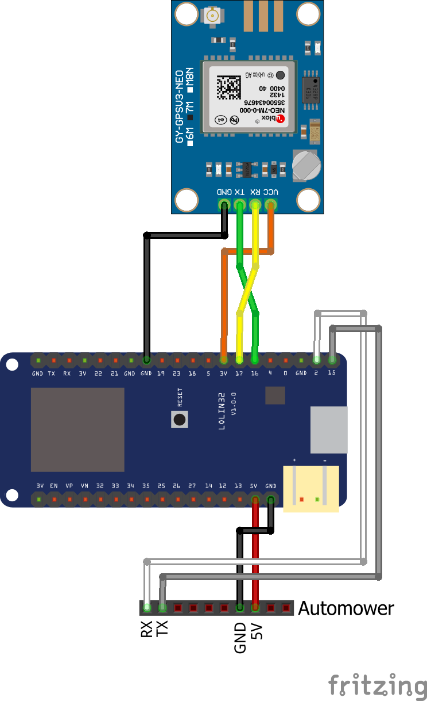
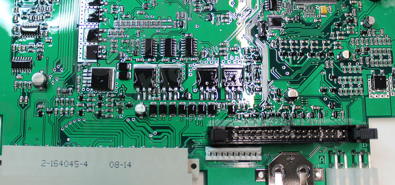
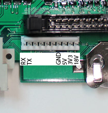
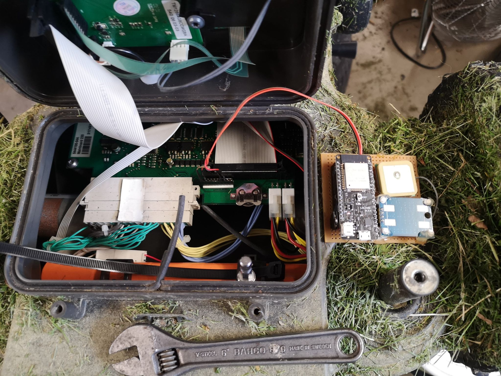

# AMConnect

This is a basic Arduino sketch to connect to a Huqsvarna Automower generation 2 robot mower.
In it's current state it connects to the Autoower and sends the status, location and debug data to a mqtt server.

The code should be seen as a Proof of Concept code and not a real product.

Feel free to modify it as you see fit.

## Software
To build the source using arduino-cli install dependency library's and update the following symbols in the Makefile:
```
ARDUINO_CLI
ARDUINO_CLI_DIR
BOARD_TYPE
SERIAL_PORT
OTA_ADDR
```

Type `make help` to show available build/load commands.


### Library Dependency
* NeoGPS (4.2.9)
* WiFi (2.0.0)
* PubSubClient (2.8)
* Uptime_Library (1.0.0)

To install library's using arduino-cli use the command:
```
arduino-cli lib install “NeoGPS”
arduino-cli lib install "WiFi"
arduino-cli lib install “PubSubClient”
arduino-cli lib install "Uptime Library"
```

## Hardware

### Example hardware
The example hardware used for this project is based around a LOLIN32 developer module and a NEO-8M  GPS.

[LOLIN32 on Amazon](https://www.amazon.com/Development-Bluetooth-Module-Lolin32-Arduino/dp/B07RZ8HHP9)

[GPS Module on Amazon](https://www.amazon.com/NEO-8M-Module-APM2-56-GYGPSV3-NEOM8N-NEO-M8N-001/dp/B07YY85WJY)

As both the ESP32 and the NEO-8M module comes in alot of different forms and shapes, remember to match the settings in the configuration file with your hardware and wiring.

For my hardware, the wiring is as shown below. (Note: I have the GPS module upside down compared to the sketch, which makes all pins (except GND) line up with the pins on the LOLIN32 board.)




### Pinout of the Automower header
The internal header to connect the hardware to is the white header, located just below the larger header for the main flat cable.



Pinout for the header




### Connect to Automower
In this example, the hardware is connected to an Husqvarna Automower 230 ACX


